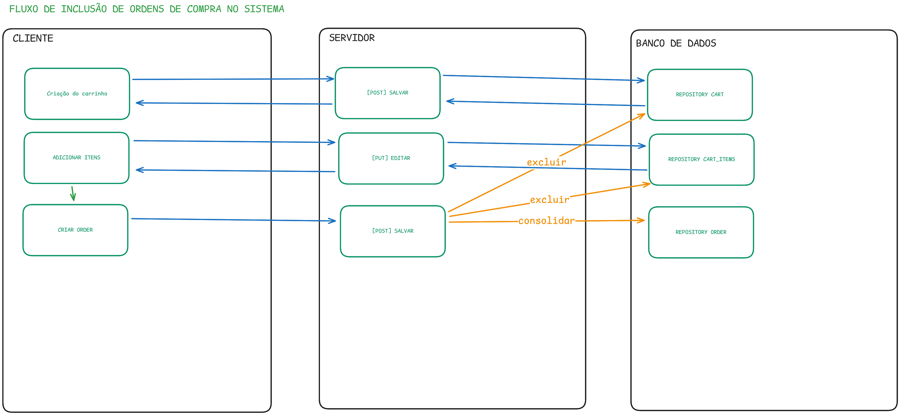

# Projeto Ambev.DeveloperEvaluation.DeveloperStore

O **Ambev.DeveloperEvaluation.DeveloperStore** é um desafio técnico criado para avaliar os conhecimentos em **.NET** e **EF Core API**. 🎯

O projeto consiste no desenvolvimento de uma API inspirada em um **e-commerce**, com funcionalidades para **carrinho**, **pedido**, **produto** e **usuário**. 🛒📦

---

## 🛠️ Tecnologias Utilizadas

As principais tecnologias e práticas adotadas no projeto são:

- ⚙️ **.NET 8**
- 🐘 **PostgreSQL**
- 📋 **Entity Framework Core (EF Core)** como ORM para manipulação de dados
- 🧩 **Domain-Driven Design (DDD)** para modelagem de entidades
- ✍️ **Code-First Approach** para criação e gerenciamento do banco de dados

---

## 🚀 Como Executar o Projeto

Para executar e depurar o projeto localmente, utilizamos o Docker para simplificar a configuração e o gerenciamento de serviços externos, como o banco de dados. Isso garante um ambiente padronizado e evita a necessidade de instalar e configurar manualmente cada dependência.

#### **Pré-requisitos**

- **Docker Desktop:** Certifique-se de que ele esteja [instalado](https://www.docker.com/products/docker-desktop/) e em execução.

#### **Instruções**

1. Clone o repositório para a sua máquina local.
2. Abra um terminal na pasta raiz do projeto.
3. Execute o comando abaixo para iniciar o contêiner com o banco de dados PostgreSQL:

   ```bash
   docker-compose up -d
   ```

4. **Clone o repositório** usando o Visual Studio.
5. **Configure a string de conexão:**
   - Acesse o arquivo: `src/Ambev.DeveloperEvaluation.WebApi/appsettings.json`
   - Atualize a `DefaultConnection` com os dados do seu banco PostgreSQL:
     ```json
     "ConnectionStrings": {
       "DefaultConnection": "Server={servidor};Database={nome-do-banco};User Id={usuario};Password={senha};TrustServerCertificate=True"
     }
     ```
6. **Defina o projeto de inicialização:** No Visual Studio, clique com o botão direito no projeto `Ambev.DeveloperEvaluation.WebApi` e selecione "Definir como projeto de inicialização".
7. **Execute a aplicação** no modo **HTTPS**.

---

## 🗃️ Gerenciamento do Banco de Dados com EF Core

Utilizamos o Entity Framework Core para o gerenciamento do schema do banco de dados através de _migrations_.

#### **Pré-requisito**

- Instale a ferramenta `dotnet-ef` globalmente, caso ainda não a tenha:
  ```bash
  dotnet tool install --global dotnet-ef
  ```

#### **Comandos**

- **Criar uma nova Migration:** Após qualquer alteração nos modelos de dados (entidades), gere uma nova migration.

  ```bash
  dotnet ef migrations add NomeDaSuaMigration --project src/Ambev.DeveloperEvaluation.ORM --startup-project src/Ambev.DeveloperEvaluation.WebApi
  ```

- **Aplicar Migrations:** Para aplicar as migrations pendentes e atualizar o banco de dados.
  ```bash
  dotnet ef database update --startup-project src/Ambev.DeveloperEvaluation.WebApi
  ```

---

## ✨ Qualidade de Código

Para manter a consistência do código, utilize a ferramenta de formatação do .NET. Execute o comando abaixo na raiz da solução antes de realizar seus commits.

```bash
dotnet format Ambev.DeveloperEvaluation.sln
```

---

## 📖 Documentação da API

- A API utiliza o **Swagger** para expor e documentar suas rotas.
- Ao executar o projeto, a página do Swagger será aberta automaticamente no seu navegador.

---

## 📖 Funcionalidade

- Criação da ordem de compra.



---

## 👨‍💻 Autor

Agradecimento especial Kaique da Mouts, e as avaliadores da AMBEV.

💡 **Contribuições e feedbacks são muito bem-vindos!** 🚀
